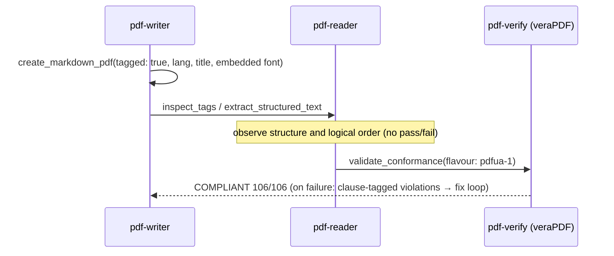

# Accessibility (PDF/UA)

## Scenario

**Produce** a PDF a screen reader can read (tagged generation → scoring), or **measure** whether
an incoming PDF has a readable structure. PDF/UA-1 (ISO 14289-1) is inside the spec corpus,
so violations can be stated **with the clause quoted** (T1 — the big difference from PDF/A).

Everything below is a **real measurement from 2026-09-04** (pdf-verify-mcp v0.26.0 /
veraPDF 1.30.0; tagged demo invoice = the passing side / the Japanese official gazette = the failing side).

## Cast

| Actor | Role |
|---|---|
| [pdf-writer](/mcp/pdf-writer) | Generation with `tagged: true`, `tag_form_fields`, `ensure_tagged` (claim only) |
| [pdf-verify](/mcp/pdf-verify) | `validate_conformance(pdfua-1)` — veraPDF delegation, violations with clause IDs |
| [pdf-reader](/mcp/pdf-reader) | `inspect_tags` (structure tree), `extract_structured_text` (logical order) |
| [pdf-publish Skill](/skills/pdf-publish) | Producer-side orchestration (`tagged` implies the `pdfua-1` gate) |

## Sequence



## Prompt examples

- "Make this report an accessible PDF, verification included"
- "Can a screen reader read this PDF? What's missing?"
- "Make this form PDF/UA conformant" (→ `tag_form_fields`)

## Measured examples — both sides

**Producer side** (`publish-demo-invoice.pdf`): `inspect_tags` reports tagged, one H1, TH 5 / TD 15 / TR 4. **veraPDF 1.30.0 judged PDF/UA-1 COMPLIANT (106/106)**. The same file is 146/146 under PDF/A-3b.

**Auditor side** (gazette, 2026-08-10 issue): **NOT COMPLIANT** — 10 of 106 rules failed (96 passed). The file is encrypted, so veraPDF scored a decrypted rewrite. Principal violations:

| Clause (ISO 14289-1) | Violation |
|---|---|
| 7.1-3 | **236** pieces of real content neither tagged nor marked as Artifact |
| 7.1-11 | No StructTreeRoot |
| 6.2-1 | No MarkInfo/Marked |
| 7.21.7-1 | 9 fonts without ToUnicode |
| 7.2-34 | Natural language for page content not determined (186 checks) |

::: details Call — validate_conformance (pdfua-1)
- Measured: pdf-verify-mcp v0.26.0, veraPDF 1.30.0

Passing side:

```jsonc
{
  "file_path": "/absolute/path/to/docs/specimens/publish-demo-invoice.pdf",
  "flavour": "pdfua-1",
  "response_format": "json"
}
```

```jsonc
{
  "engine": "verapdf",
  "flavour": "PDF/UA-1",
  "compliant": true,
  "checkedRules": 106,
  "passedRules": 106,
  "failedRules": 0
}
```

The failing side uses the same arguments with the gazette path: `compliant: false`, `failedRules: 10`.
:::

## Measured example — the `ensure_tagged` warning (2026-09-16, second host)

Since pdf-writer-mcp v0.21.1, `ensure_tagged` returns the same kind of warning as `ensure_pdfa`, separating "a label was written" from "the score passed"
(host Grok Build 1.0.30; pdf-verify-mcp v0.26.1 / veraPDF 1.30.0).

Running `ensure_tagged` on a Japanese report generated with tagging gave `wasTagged: true`, `createdStructure: false` (the structure tree already existed and was left alone), additions limited to Lang / DisplayDocTitle / XMP pdfuaid, and this as `warnings[0]`:

```
This file now CLAIMS PDF/UA-1 (pdfuaid:part=1), but conformance was NOT checked here. Only document-level
tagging requirements were supplied; reading order, alternative text, and similar PDF/UA rules are left as they are.
```

`validate_conformance` (pdfua-1) on the same file: veraPDF 106/106, with the note that the meaning of alt text and reading order cannot be judged by machine.
The untagged control file scored 99/106, failing 7.1-3, 7.2-34, 7.1-10, 7.1-11, 7.21.4.1-1, 6.2-1 and 7.1-8.
`pdf-spec`'s `get_requirements` (pdfua1, §7.1, shall) returned 10 clauses; R-7.1-3 (semantically appropriate tags and logical order) is the clause behind the failure.

Still open: `create_markdown_pdf` (tagged) produces two H1 elements when the title and the first heading are the same string. veraPDF passes it, but the heading appears twice in `extract_structured_text`.

Full report: [eval/hosts/grok-build/reports/UC04.md](https://github.com/shuji-bonji/pdf-agent-stack/blob/main/eval/hosts/grok-build/reports/UC04.md) (Japanese)

## How to read the results

- **PDF/UA-1 is T1** — a violation can be stated as "ISO 14289-1 7.1-3 requires…", one step
  stronger than PDF/A's "veraPDF judged it so"
- Native-engine violations carry a severity: only **error** proves non-conformance (warnings need human review)
- With `tagged: true`, an **embedded font and a title are mandatory** even without CJK text
  (the standard 14 fonts always violate 7.21.4.1)
- Machines validate structure only. **Whether alt text is meaningful and the reading order is
  natural remains human review**
- `ensure_tagged` writes a label — once used, `pdfua-1` must be measured
