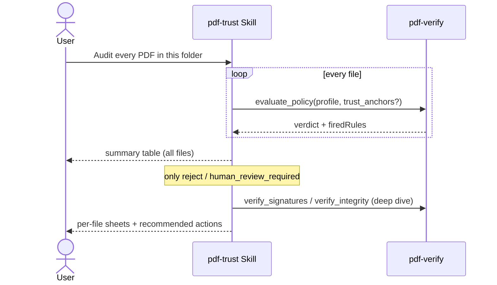

# Batch Audit

## Scenario

Audit a whole folder of received PDFs and spend human attention **only on the problem files**.
First run `evaluate_policy` over everything to triage; deep-dive only reject /
human_review_required — deep-diving everything wastes time and context.

Below is a **real measurement from 2026-08-11** (5 specimens, producing all four verdicts).

## Cast

| Actor | Role |
|---|---|
| [pdf-trust Skill](/skills/pdf-trust) | Batch orchestration, summary table, per-file sheets only for problems |
| [pdf-verify](/mcp/pdf-verify) | `evaluate_policy` over every file (deterministic = reproducible) |

## Sequence

## Prompt examples

- "Run an incoming audit on every PDF under `/received/2026-08/`. Invoices as financial"
- "These 30 from partner A — here's their CA certificate. Judge them all"
- "For the rejects only: what exactly is broken?"

## Measured example — the 5-specimen summary

| Specimen | Profile | Verdict |
|---|---|---|
| Self-made signature + CRL in DSS + trust anchor | general | `trust_and_use` |
| Official gazette, 2026-08-10 issue | government | `use_with_caution` |
| Self-made signature (no CRL) | general | `use_with_caution` |
| Unsigned invoice | contract | `human_review_required` |
| One byte flipped inside the signed range | general | `reject` |

Only 2 of 5 files needed a deep dive (review / reject); the reject sheet goes down to
"digest mismatch, signature and DocTS both invalid — while the signature timestamp stays valid
(the content was altered, not the signature value)".

## How to read the results

- **Same file + same profile = same verdict, always.** Independent of the model and the day —
  reproducibility lives in the rule engine
- Sort by the summary verdicts; **attach per-file sheets only to problems** (kinder to the reader too)
- Profiles can vary per file type (invoices = financial, contracts = contract)
- When everything clusters at `use_with_caution`, missing trust anchors are the usual cause —
  obtain the CA certificate once and the whole batch gains identity evaluation
