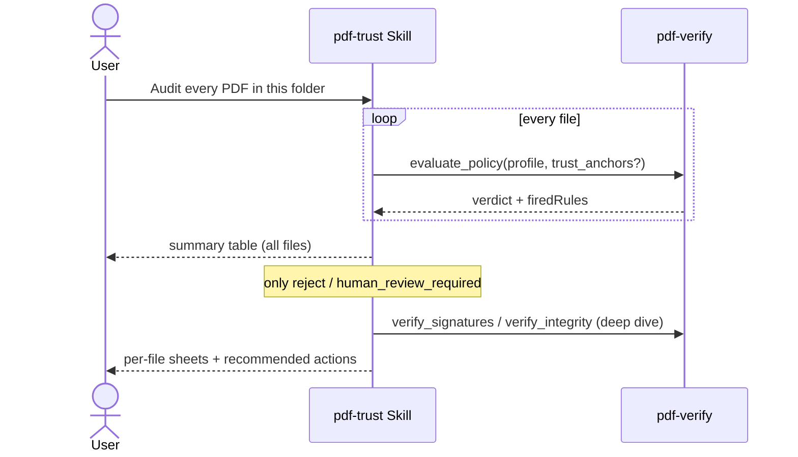

# Batch Audit

## Scenario

Audit a whole folder of received PDFs and spend human attention **only on the problem files**.
First run `evaluate_policy` over everything to triage; deep-dive only reject /
human_review_required — deep-diving everything wastes time and context.

Below is a **real measurement from 2026-09-04** (pdf-verify-mcp v0.26.0; 5 specimens, producing all four verdicts).

## Cast

| Actor | Role |
|---|---|
| [pdf-trust Skill](/skills/pdf-trust) | Batch orchestration, summary table, per-file sheets only for problems |
| [pdf-verify](/mcp/pdf-verify) | `evaluate_policy` over every file (deterministic = reproducible) |

## Sequence



## Prompt examples

- "Run an incoming audit on every PDF under `/received/2026-08/`. Invoices as financial"
- "These 30 from partner A — here's their CA certificate. Judge them all"
- "For the rejects only: what exactly is broken?"

## Measured example — the 5-specimen summary

| Specimen | Profile | Verdict |
|---|---|---|
| `selfmade-pades-crl.pdf` + `selfmade-ca2.pem` | general | `trust_and_use` (no rules fired; revocation `good`; structure B-LTA) |
| `kanpo-20260810-h01765-p1.pdf` | government | `use_with_caution` |
| `selfmade-pades-lta.pdf` + `selfmade-ca.pem` | general | `use_with_caution` (`POL-CAUTION-REVOCATION-UNKNOWN`; structure B-T) |
| `publish-demo-invoice.pdf` (unsigned) | contract | `human_review_required` (`POL-REVIEW-UNSIGNED-REQUIRED`) |
| `selfmade-tampered.pdf` | general | `reject` (`POL-REJECT-INVALID`; both Sig1 and the document timestamp `invalid`) |

The CRL specimen stays `untrusted` with `selfmade-ca.pem`. `trust_and_use` needs `selfmade-ca2.pem`.

Only 2 of 5 files need a deep dive (review / reject). On reject, facts show both Sig1 and the document timestamp as `invalid`.

::: details Call — evaluate_policy × 5
Specimens under `docs/specimens/` (pass absolute paths). `response_format`: `"json"`.

```jsonc
// trust_and_use
{ "file_path": "…/selfmade-pades-crl.pdf", "profile": "general",
  "trust_anchors": ["…/selfmade-ca2.pem"], "response_format": "json" }

// use_with_caution (gazette)
{ "file_path": "…/kanpo-20260810-h01765-p1.pdf", "profile": "government", "response_format": "json" }

// use_with_caution (no CRL)
{ "file_path": "…/selfmade-pades-lta.pdf", "profile": "general",
  "trust_anchors": ["…/selfmade-ca.pem"], "response_format": "json" }

// human_review_required
{ "file_path": "…/publish-demo-invoice.pdf", "profile": "contract", "response_format": "json" }

// reject
{ "file_path": "…/selfmade-tampered.pdf", "profile": "general", "response_format": "json" }
```

Returned `verdict` values match the table. The same file and the same `profile` (and anchors) always yield the same verdict.
:::

## How to read the results

- **Same file + same profile = same verdict, always.** Independent of the model and the day —
  reproducibility lives in the rule engine
- Sort by the summary verdicts; **attach per-file sheets only to problems** (kinder to the reader too)
- Profiles can vary per file type (invoices = financial, contracts = contract)
- When everything clusters at `use_with_caution`, missing trust anchors are the usual cause —
  obtain the CA certificate once and the whole batch gains identity evaluation
