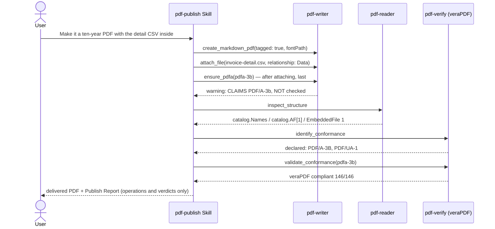

# Invoice for Japan's e-Bookkeeping Rules (Denchōhō)

::: warning What this page covers
Only PDF-level operations: attaching a file, labelling the container as PDF/A-3b, and scoring it with veraPDF.
It does not diagnose whether the file satisfies the retention requirements of Japan's Electronic Books Preservation Act (電子帳簿保存法, "Denchōhō"),
and it never says the file "complies" with it. Legal requirements are read from the primary text via the [houki MCPs](/guide/agents); the judgement is a human's.
:::

## Scenario

The request is: "Turn this invoice into a PDF that keeps for ten years, with the line-item CSV inside. Run the checks and deliver."
The pdf-publish Skill runs write → read-back → verify: the CSV goes in with `attach_file`, `ensure_pdfa` runs last, and the veraPDF verdict
goes into the Publish Report. "Keeps for ten years" is **not** stretched into PAdES long-term validation (LTV); nothing is signed.

Below is a **real measurement from 2026-09-15** (pdf-writer-mcp v0.21.0 / pdf-verify-mcp v0.26.0 / veraPDF 1.30.0; host Grok Build 1.0.30;
a fictitious invoice whose registration number `T0000000000000` is deliberately fake).

## Cast

| Actor | Role |
|---|---|
| [pdf-publish Skill](/skills/pdf-publish) | write → read-back → verify orchestration; Publish Report |
| [pdf-writer](/mcp/pdf-writer) | `create_markdown_pdf` (tagged) → `attach_file` (CSV, relationship: Data) → `ensure_pdfa` (pdfa-3b, **always last**) |
| [pdf-reader](/mcp/pdf-reader) | `inspect_structure` to read back the catalog's `AF` / `Names` |
| [pdf-verify](/mcp/pdf-verify) | `identify_conformance` (declaration) → `validate_conformance` (veraPDF score) |

## Sequence



## Prompt examples

- "Turn this invoice into a PDF that keeps for ten years, with the line-item CSV inside. Run the checks and deliver. Don't sign it"
- "PDF/A-3b with the attachment. Include the veraPDF result"
- "Read it back and confirm the attachment is really in the catalog"

## Measured example — dummy invoice + detail CSV

| Step | Tool | Measured |
|---|---|---|
| 1 | `create_markdown_pdf` (tagged, fontPath given) | pageCount 1 |
| 2 | `attach_file` (`relationship: "Data"`) | `text/csv`, 151 bytes |
| 3 | `ensure_pdfa` (pdfa-3b, last) | warning: **CLAIMS PDF/A-3b … conformance was NOT checked**. Flavour stayed 3b (not downgraded to 1b) |
| 4 | `inspect_structure` | catalog has `Names` (dict) and `AF` (Array[1]); `EmbeddedFile` 1, `Filespec` 1 |
| 5 | `identify_conformance` | declared PDF/A part 3 conformance B and PDF/UA part 1 (a declaration, not a verdict) |
| 6 | `validate_conformance` (pdfa-3b) | engine `verapdf`, `compliant: true`, 146/146 |
| — | `detect_pades_level` | **not performed**: no signature, so not called. "Ten years" was not stretched into LTV |

::: details Calls — attach_file / ensure_pdfa / validate_conformance
```jsonc
{ "inputPath": "/absolute/path/to/denshi-step1.pdf", "attachmentPath": "/absolute/path/to/invoice-detail.csv",
  "relationship": "Data", "outputPath": "/absolute/path/to/denshi-attached.pdf" }
```

```jsonc
{ "inputPath": "/absolute/path/to/denshi-attached.pdf", "flavour": "pdfa-3b",
  "outputPath": "/absolute/path/to/denshi-invoice.pdf" }
```

```jsonc
{ "file_path": "/absolute/path/to/denshi-invoice.pdf", "flavour": "pdfa-3b", "response_format": "json" }
```

```jsonc
{ "engine": "verapdf", "flavour": "PDF/A-3b", "compliant": true,
  "checkedRules": 146, "passedRules": 146, "failedRules": 0 }
```
:::

**Closing line of the Publish Report** (quoted): the CSV was attached and veraPDF judged the file PDF/A-3b COMPLIANT (146/146). It does not say the file complies with Denchōhō.

## How to read the results

- **Only the operations performed and the veraPDF verdict may be written down.** "CSV attached as Data", "veraPDF judged PDF/A-3b COMPLIANT (146/146)" — never "Denchōhō-compliant" or "ISO 19005 conformant"
- The `ensure_pdfa` warning (CLAIMS … NOT checked) is never dropped. Writing the label and passing the score are two different things (→ [Long-term Archive (PDF/A)](/use-cases/pdfa-archive))
- The attachment is confirmed via `inspect_structure` using the **catalog's field names** (`Names`, `AF`, `EmbeddedFile`). A success return from the writer is not evidence that the attachment is there
- A request that says "ten years" does not license adding signatures or LTV on your own. `detect_pades_level` is not called on an unsigned file
- With an attachment, PDF/A-4 means **`pdfa-4f`**. Plain `pdfa-4` requires the attachment itself to be PDF/A

Evaluation kit and full report: [eval/grok-eval/reports/UC08.md](https://github.com/shuji-bonji/pdf-agent-stack/blob/main/eval/grok-eval/reports/UC08.md) (Japanese)
