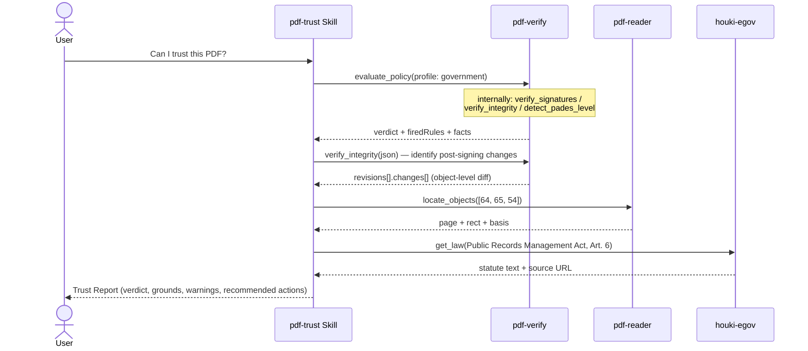

# Incoming PDF Audit

## Scenario

Before an incoming PDF (contract, invoice, government document, medical report) enters your
workflow, decide whether it is **genuine, untampered, and trustworthy**. The verdict is not an
LLM's impression — pdf-verify's deterministic rule engine (`evaluate_policy`) decides it: the
same file and the same profile always yield the same verdict.

Everything below is a **real measurement from 2026-08-11** (the Japanese official gazette,
2026-08-10 issue, and other real specimens).

## Cast

| Actor | Role |
|---|---|
| [pdf-trust Skill](/skills/pdf-trust) | Orchestration, explaining firedRules, recommending actions. **Never judges** |
| [pdf-verify](/mcp/pdf-verify) (required) | `evaluate_policy` (4-value verdict), signature verification, tamper detection, PAdES observation |
| [pdf-reader](/mcp/pdf-reader) (optional) | `locate_objects` — turns a changed object into "page + rectangle" |
| houki MCPs (optional) | Fetching the statutory grounds a profile requires |

## Sequence

## Prompt examples

- "Can I trust this PDF? Run an incoming audit: `/path/to/kanpo-20260810.pdf`"
- "Audit this contract from a counterparty. Their CA certificate is `/path/to/partner-ca.pem`" (→ profile: contract + trust_anchors)
- "Check whether anything was written into it after signing" (→ the Phase 2.5 deep dive)

## Measured example — the official gazette (profile: government)

Verdict: **use_with_caution**. Two rules fired:

| Fired rule | Meaning |
|---|---|
| POL-CAUTION-TRUST-NOT-EVALUATED | Cryptographic integrity confirmed; **signer identity not evaluated** (no trust anchors) |
| POL-CAUTION-REVOCATION-UNKNOWN | No revocation data in the document — "not revoked" cannot be claimed |

Facts: Cabinet Office signature = **valid** (SECOM chain, SHA-256, digest match) /
AMANO document timestamp = **valid** / PAdES structure = B-B.

Phase 2.5 then identifies what the "+9,938 bytes after signing" actually are:

| Object | Change | Role |
|---|---|---|
| 64 | added | form field widget (invisible, p.1) |
| 65 | added | **/DocTimeStamp signature dictionary** |
| 54 | modified | AcroForm dictionary |

→ The post-signing change is **the application of the AMANO timestamp itself**. Incremental
updates are legal (ISO 32000-2 §7.5.6); this table shows where to look, not proof of tampering.

## How to read the results

- **Code decides the verdict.** `use_with_caution` does not mean "suspicious" — integrity is
  confirmed; identity evaluation and revocation are simply not done yet. Supply the CA as a
  trust anchor and get revocation to good, and the verdict rises to `trust_and_use`
  ([measured: a pair of specimens differing only in a CRL](/skills/pdf-trust))
- **Never mix "absent" with "unknown".** revocation: unknown is not "not revoked". A check that
  could not be measured is recorded as "not performed" — never as passed
- A PAdES level is a **structural observation** (T3): "the structure matches B-B", never "PAdES-conformant"
- Statutory grounds are quoted from the houki MCPs' **original text**, never from memory
