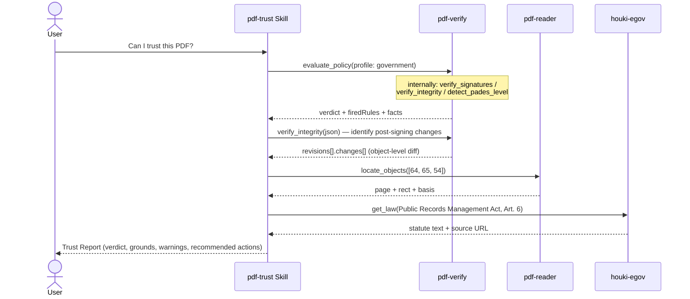

# Incoming PDF Audit

## Scenario

Before an incoming PDF (contract, invoice, government document, medical report) enters your
workflow, decide whether it is **genuine, untampered, and trustworthy**. The verdict is not an
LLM's impression — pdf-verify's deterministic rule engine (`evaluate_policy`) decides it: the
same file and the same profile always yield the same verdict.

Everything below is a **real measurement from 2026-09-04** (pdf-verify-mcp v0.26.0 /
pdf-reader-mcp v0.15.0; the Japanese official gazette, 2026-08-10 issue, and other
specimens under `docs/specimens/`).

## Cast

| Actor | Role |
|---|---|
| [pdf-trust Skill](/skills/pdf-trust) | Orchestration, explaining firedRules, recommending actions. **Never judges** |
| [pdf-verify](/mcp/pdf-verify) (required) | `evaluate_policy` (4-value verdict), signature verification, tamper detection, PAdES observation |
| [pdf-reader](/mcp/pdf-reader) (optional) | `locate_objects` — turns a changed object into "page + rectangle" |
| houki MCPs (optional) | Fetching the statutory grounds a profile requires |

## Sequence



## Prompt examples

- "Can I trust this PDF? Run an incoming audit: `/path/to/kanpo-20260810.pdf`"
- "Audit this contract from a counterparty. Their CA certificate is `/path/to/partner-ca.pem`" (→ profile: contract + trust_anchors)
- "Check whether anything was written into it after signing" (→ the Phase 2.5 deep dive)

## Measured example — the official gazette (profile: government)

`evaluate_policy` returned **use_with_caution**. Two rules fired:

| Fired rule | Meaning |
|---|---|
| POL-CAUTION-TRUST-NOT-EVALUATED | Cryptographic integrity confirmed; **signer identity not evaluated** (no trust anchors) |
| POL-CAUTION-REVOCATION-UNKNOWN | No revocation data in the document — "not revoked" cannot be claimed |

Facts: `Signature1` (Cabinet Office) = **valid** / `e-timing EVIDENCE3161_1` (document timestamp) = **valid** / PAdES structure = B-B (T3 observation). The government profile's PDF/A check is recorded as "not performed" (the file is encrypted, so veraPDF cannot be given it).

`verify_integrity`: file 139,503 bytes, one incremental update. **+9,938 bytes** after `Signature1`'s signed range. The last signature (the document timestamp) covers the whole file, so `objectChangesAfterLastSignature` is empty. The +9,938-byte revision touched **six objects** (`changeCount: 6`), each carrying the `changeClass` that says what kind of change it is:

| Object | Change | `changeClass` | Role |
|---|---|---|---|
| 64 | added | form-fill | form field widget (`locate_objects`: p.1, `annotation-rect` 0×0) |
| 65 | added | unknown | the signature dictionary itself — `locate_objects` reads its type as **DocTimeStamp**; no place on any page |
| 54 | modified | form-fill | AcroForm dictionary (no place on any page) |
| 7 | modified | housekeeping | document catalog |
| 8 | modified | housekeeping | page object (its `/Annots` grew) |
| 5 | modified | housekeeping | type not readable |

The three housekeeping rows are what a permitted change necessarily drags along, which is why they are classified apart rather than counted as findings. The post-signing change is **the document timestamp itself**. Incremental updates are permitted in PDF (ISO 32000-2 §7.5.6). This table is what to look at, not proof of tampering.

::: details Call — evaluate_policy (government, no anchors)
- Measured: pdf-verify-mcp v0.26.0
- Specimen: `docs/specimens/kanpo-20260810-h01765-p1.pdf` (pass an absolute path)
- `profile`: `"government"`
- `response_format`: `"json"`

**Parameters**

```jsonc
{
  "file_path": "/absolute/path/to/docs/specimens/kanpo-20260810-h01765-p1.pdf",
  "profile": "government",
  "response_format": "json"
}
```

**Returned JSON** (`scope` and `notes` omitted)

```jsonc
{
  "profile": "government",
  "verdict": "use_with_caution",
  "firedRules": [
    { "ruleId": "POL-CAUTION-TRUST-NOT-EVALUATED", "verdict": "use_with_caution" },
    { "ruleId": "POL-CAUTION-REVOCATION-UNKNOWN", "verdict": "use_with_caution" }
  ],
  "facts": {
    "signatureCount": 1,
    "signatures": [
      { "fieldName": "Signature1", "verdict": "valid", "trust": "not_evaluated", "revocation": "unknown" },
      { "fieldName": "e-timing EVIDENCE3161_1", "verdict": "valid", "isDocumentTimestamp": true }
    ],
    "padesLevels": [{ "fieldName": "Signature1", "level": "B-B", "normativeBasis": "T3" }]
  }
}
```
:::

::: details Call — verify_integrity then locate_objects
Take object numbers from `verify_integrity`'s `revisions[1].changes` and pass them to `locate_objects`.

```jsonc
{
  "file_path": "/absolute/path/to/docs/specimens/kanpo-20260810-h01765-p1.pdf",
  "object_numbers": [64, 65, 54],
  "response_format": "json"
}
```

```jsonc
{
  "objects": [
    { "objectNumber": 64, "found": true, "type": "Annot", "subtype": "Widget",
      "locations": [{ "page": 1, "rect": { "x1": 0, "y1": 0, "x2": 0, "y2": 0 }, "basis": "annotation-rect" }] },
    { "objectNumber": 65, "found": true, "type": "DocTimeStamp", "locations": [],
      "reason": "No page references this object, so it has no place on any page." },
    { "objectNumber": 54, "found": true, "locations": [],
      "reason": "No page references this object, so it has no place on any page." }
  ],
  "isEncrypted": true
}
```

The file is encrypted, so coordinates and types come back but field names are `null` (ISO 32000-1 §7.6.2).
:::

## How to read the results

- **Code decides the verdict.** `use_with_caution` does not mean "suspicious" — integrity is
  confirmed; identity evaluation and revocation are simply not done yet. Supply the CA as a
  trust anchor and get revocation to good, and the verdict rises to `trust_and_use`
  ([measured: a pair of specimens differing only in a CRL](/skills/pdf-trust))
- **Never mix "absent" with "unknown".** revocation: unknown is not "not revoked". A check that
  could not be measured is recorded as "not performed" — never as passed
- A PAdES level is a **structural observation** (T3): "the structure matches B-B", never "PAdES-conformant"
- Statutory grounds are quoted from the houki MCPs' **original text**, never from memory
