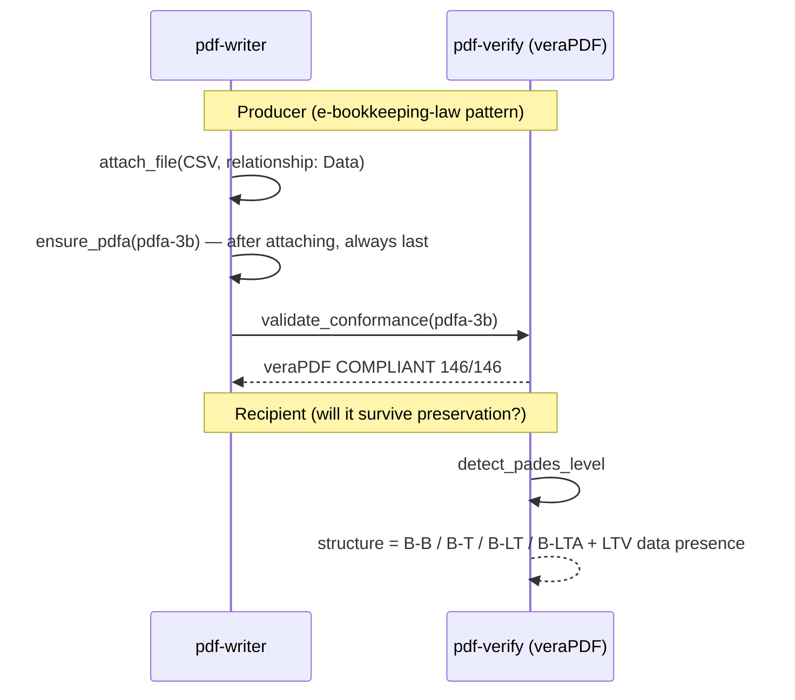

# Long-Term Preservation (PDF/A)

## Scenario

Leave behind a PDF that still opens, reads, and **verifies** ten years from now. In the Japanese
e-bookkeeping-law context (bundling machine-readable data) or for public records, the
**producer** puts the document onto the PDF/A vessel and has veraPDF score it; the **recipient**
checks whether the document's structure can survive preservation (does LTV data really exist?).

Everything below is a **real measurement from 2026-08-11** (demo invoice, the Japanese official
gazette, and self-made known-good specimens).

## Cast

| Actor | Role |
|---|---|
| [pdf-writer](/mcp/pdf-writer) | `attach_file` (bundle machine-readable data) → `ensure_pdfa` (the vessel — **writes a label only**) |
| [pdf-verify](/mcp/pdf-verify) | `validate_conformance` (veraPDF) / `detect_pades_level` (LTV structure observation) |
| [pdf-trust](/skills/pdf-trust) / [pdf-publish](/skills/pdf-publish) | Intake / outbound orchestration |

## Sequence

## Prompt examples

- "Put this invoice, CSV included, into the e-bookkeeping-law preservation format" (→ attach_file + ensure_pdfa(pdfa-3b))
- "Will this contract survive ten years? Can the signature still be verified after the certificate expires?" (→ detect_pades_level + DSS check)
- "Use PDF/A-4" (→ with attachments it must be **`pdfa-4f`** — plain `pdfa-4` requires every attachment to be PDF/A itself)

## Measured examples

**Producer side** (demo invoice): CSV attached → `ensure_pdfa(pdfa-3b)` → **veraPDF judged it
COMPLIANT (146/146)**. `ensure_pdfa` always warns that only the claim was written and conformance
was not checked — never deliver without measuring.

**Recipient side** (preservability of signed documents — three specimens compared):

| Specimen | Structural observation | Meaning |
|---|---|---|
| Official gazette, 2026-08-10 issue | **B-B** (no signature TS, no DSS; DocTS present) | **Risk of becoming unverifiable** after certificate expiry/revocation. Reinforce via the acquisition channel |
| Self-made specimen (no CRL) | B-T | Revocation checking still depends on the outside world |
| Self-made specimen (**CRL embedded in DSS**) | **B-LTA** | Verification material is self-contained — the only difference is the CRL (both specimens carry a document timestamp from the start, so the CRL completes B-LT and B-LTA at once) |

`detect_pades_level` checks whether the DSS revocation data **actually covers the signer** —
a "declared-only B-LT" is capped down to B-T.

## How to read the results

- **veraPDF is the judge for PDF/A** (T2): write "veraPDF judged it COMPLIANT (146/146)",
  never "conforms to ISO 19005"
- **A PAdES level is a structural observation** (T3): "the structure matches B-LTA",
  never "B-LTA-conformant"
- `ensure_pdfa` **writes a label**; it does not make the file meet the standard. Unembedded fonts, encryption
  and JavaScript are not repaired — applied to a non-conforming file it produces a PDF that lies
  about itself
- veraPDF may return no PDF/A result for an encrypted PDF (measured with the gazette). That check
  is recorded as "not performed" — never as passed
