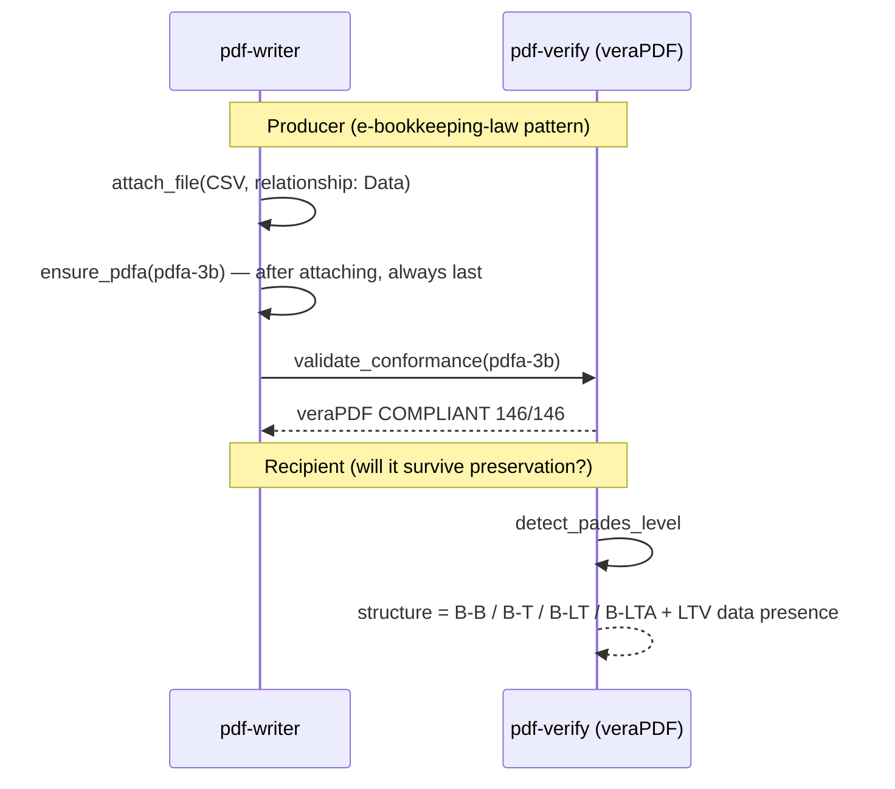

# Long-Term Preservation (PDF/A)

## Scenario

Leave behind a PDF that still opens, reads, and **verifies** ten years from now. In the Japanese
e-bookkeeping-law context (bundling machine-readable data) or for public records, the
**producer** puts the document onto the PDF/A vessel and has veraPDF score it; the **recipient**
checks whether the document's structure can survive preservation (does LTV data really exist?).

Everything below is a **real measurement from 2026-09-04** (pdf-verify-mcp v0.26.0 /
veraPDF 1.30.0; demo invoice, the Japanese official gazette, and self-made specimens).

## Cast

| Actor | Role |
|---|---|
| [pdf-writer](/mcp/pdf-writer) | `attach_file` (bundle machine-readable data) → `ensure_pdfa` (the vessel — **writes a label only**) |
| [pdf-verify](/mcp/pdf-verify) | `validate_conformance` (veraPDF) / `detect_pades_level` (LTV structure observation) |
| [pdf-trust](/skills/pdf-trust) / [pdf-publish](/skills/pdf-publish) | Intake / outbound orchestration |

## Sequence



## Prompt examples

- "Put this invoice, CSV included, into the e-bookkeeping-law preservation format" (→ attach_file + ensure_pdfa(pdfa-3b))
- "Will this contract survive ten years? Can the signature still be verified after the certificate expires?" (→ detect_pades_level + DSS check)
- "Use PDF/A-4" (→ with attachments it must be **`pdfa-4f`** — plain `pdfa-4` requires every attachment to be PDF/A itself)

## Measured examples

**Producer side** (`publish-demo-invoice.pdf`): catalog has Names / AF / OutputIntents. **veraPDF 1.30.0 judged PDF/A-3b COMPLIANT (146/146)**. The same file is 106/106 under PDF/UA-1.

**Recipient side** (`detect_pades_level`, three specimens):

| Specimen | Structural observation | Evidence |
|---|---|---|
| Gazette, 2026-08-10 issue | **B-B** | no signature TS, no DSS, DocTS present |
| `selfmade-pades-lta.pdf` (no CRL) | **B-T** | DSS present but `revocationDataCoversSigner: false` (dssCrlCount 0) |
| `selfmade-pades-crl.pdf` (CRL in DSS) | **B-LTA** | `revocationDataCoversSigner: true` (dssCrlCount 1) |

`detect_pades_level` checks whether the DSS revocation data **actually covers the signer certificate**. Without that coverage the level stops at B-T. That is a T3 observation, not "conforms to PAdES".

::: details Call — validate_conformance and detect_pades_level
- Measured: pdf-verify-mcp v0.26.0, veraPDF 1.30.0

```jsonc
{
  "file_path": "/absolute/path/to/docs/specimens/publish-demo-invoice.pdf",
  "flavour": "pdfa-3b",
  "response_format": "json"
}
```

```jsonc
{
  "engine": "verapdf",
  "flavour": "PDF/A-3b",
  "compliant": true,
  "checkedRules": 146,
  "passedRules": 146,
  "failedRules": 0
}
```

```jsonc
{
  "file_path": "/absolute/path/to/docs/specimens/selfmade-pades-crl.pdf",
  "response_format": "json"
}
```

```jsonc
{
  "levels": [
    {
      "fieldName": "Sig1",
      "level": "B-LTA",
      "normativeBasis": "T3",
      "evidence": { "hasSignatureTimestamp": true, "hasDss": true, "hasDocumentTimestamp": true },
      "ltv": { "dssCrlCount": 1, "revocationDataCoversSigner": true }
    }
  ]
}
```
:::

## Measured example — a file whose label and score disagree (2026-09-15, second host)

To confirm that the label `ensure_pdfa` writes is never read as conformance, a deliberately non-conformant file was put through the same gate
(pdf-writer-mcp v0.21.0 / pdf-verify-mcp v0.26.0 / veraPDF 1.30.0; host Grok Build 1.0.30).

| Step | Tool | Measured |
|---|---|---|
| 1 | `create_text_pdf` (English, no fontPath) | font is Helvetica (not embedded) |
| 2 | `ensure_pdfa` (pdfa-3b) only | `declarationRisks: FONT_NOT_EMBEDDED (Helvetica)`; warning: **CLAIMS PDF/A-3b … conformance was NOT checked** |
| 3 | `identify_conformance` | declared `pdfA: { part: "3", conformance: "B" }`; notes: identifies declared conformance only |
| 4 | `validate_conformance` (pdfa-3b) | engine `verapdf`, **`compliant: false`**, 145/146; failing rule `ISO 19005-3:2012 6.2.11.4.1-1` (font not embedded) |

The summary written right after step 3 was: "The file claims PDF/A-3b. ensure_pdfa only added /ID, an OutputIntent and XMP pdfaid; conformance was not examined."
It did not say "it is now PDF/A". The correct report is three sentences: **it claims** (identify) / **veraPDF's verdict is** non-COMPLIANT, 145/146, 6.2.11.4.1-1 (validate) / **the warning says** CLAIMS … NOT checked (ensure_pdfa).

Full report: [eval/grok-eval/reports/UC09.md](https://github.com/shuji-bonji/pdf-agent-stack/blob/main/eval/grok-eval/reports/UC09.md) (Japanese)

## How to read the results

- **veraPDF is the judge for PDF/A** (T2): write "veraPDF judged it COMPLIANT (146/146)",
  never "conforms to ISO 19005"
- **A PAdES level is a structural observation** (T3): "the structure matches B-LTA",
  never "B-LTA-conformant"
- `ensure_pdfa` **writes a label**; it does not make the file meet the standard. Unembedded fonts, encryption
  and JavaScript are not repaired — applied to a non-conforming file it produces a PDF that lies
  about itself
- veraPDF may return no PDF/A result for an encrypted PDF (measured with the gazette). That check
  is recorded as "not performed" — never as passed

## Re-run on a second host (2026-09-15, Grok Build 1.0.30)

For the request "save as PDF/A-4, keep the CSV", the flavour chosen was **`pdfa-4f`**, and veraPDF judged it COMPLIANT (109/109). `detect_pades_level` on the three specimens (gazette B-B / no CRL B-T / CRL in DSS B-LTA) matched the measurements above. The specimen whose label and score disagree is in the section above. Report: [UC03.md](https://github.com/shuji-bonji/pdf-agent-stack/blob/main/eval/grok-eval/reports/UC03.md) (Japanese)
