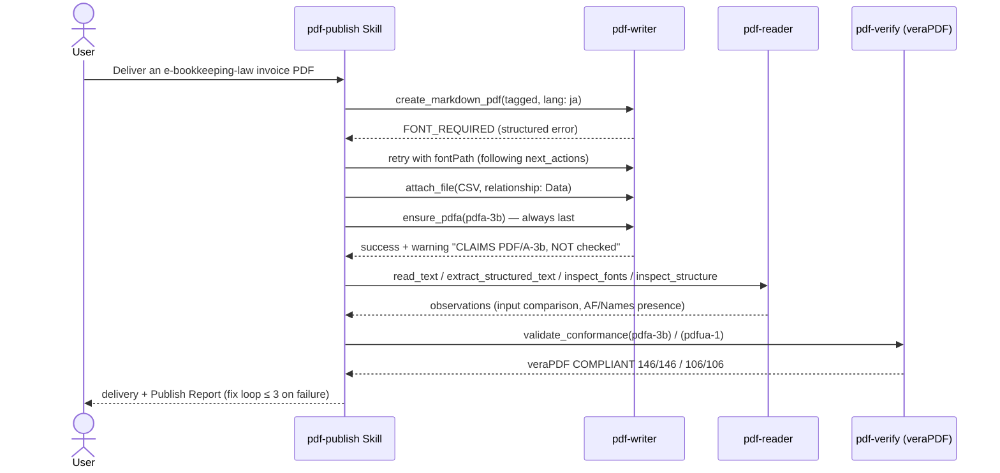

# Delivery Pipeline

## Scenario

"Make a PDF and deliver it" — without leaving it unchecked. pdf-writer writes it, pdf-reader
reads it back to observe whether it matches the intent, and pdf-verify (veraPDF) scores it
before delivery. Only verify decides pass/fail; the writer's exit code is never taken as proof
that the output matches the request.

The write sequence (`FONT_REQUIRED` → retry with fontPath) is the **2026-08-11** Publish Report.
Read-back and gates on the stored deliverable `publish-demo-invoice.pdf` were **re-measured on 2026-09-04**
(pdf-writer-mcp v0.21.0 / pdf-reader-mcp v0.15.0 / pdf-verify-mcp v0.26.0 / veraPDF 1.30.0).

## Cast

| Actor | Role |
|---|---|
| [pdf-publish Skill](/skills/pdf-publish) | Orchestration, transcribing warnings, the Publish Report |
| [pdf-writer](/mcp/pdf-writer) (required) | Writing, attaching, PDF/A vessel (`ensure_pdfa`) |
| [pdf-reader](/mcp/pdf-reader) (recommended) | Read-back observation (never pass/fail) |
| [pdf-verify](/mcp/pdf-verify) (required at conformance level) | `validate_conformance` (delegates to veraPDF) |

## Sequence



## Prompt examples

- "Turn this invoice data into an e-bookkeeping-law PDF. Bundle the CSV, verify, then deliver"
- "Make this report an accessible PDF (PDF/UA), quality-assured"
- "Just a draft PDF is fine" (→ gate level `none`, and the report says so)

## Measured example — the demo invoice's Publish Report

| Phase | Result |
|---|---|
| Write (2026-08-11) | `FONT_REQUIRED` → recovered via the structured error's `next_actions` (fontPath). attach (Data) → ensure_pdfa (last) |
| Read-back (2026-09-04) | `inspect_tags`: tagged, one H1, TH 5 / TD 15 / TR 4. Catalog has StructTreeRoot, MarkInfo, Lang, Names, AF, OutputIntents |
| Gate (2026-09-04) | **veraPDF 1.30.0 judged PDF/A-3b COMPLIANT (146/146) and PDF/UA-1 COMPLIANT (106/106)** |
| Fix loop | 0 iterations |

::: details Call — gates on the stored deliverable (re-measured)
- Measured: pdf-verify-mcp v0.26.0, veraPDF 1.30.0
- Specimen: `docs/specimens/publish-demo-invoice.pdf`

```jsonc
{
  "file_path": "/absolute/path/to/docs/specimens/publish-demo-invoice.pdf",
  "flavour": "pdfa-3b",
  "response_format": "json"
}
```

```jsonc
{
  "engine": "verapdf",
  "flavour": "PDF/A-3b",
  "compliant": true,
  "checkedRules": 146,
  "passedRules": 146,
  "failedRules": 0
}
```

With `flavour: "pdfua-1"`, `checkedRules` / `passedRules` are 106 and `compliant` is true.
:::

`ensure_pdfa` always returns a warning even on success ("CLAIMS … NOT checked"). That is design:
the machine keeps saying that **writing a label makes verification non-optional**. The write sequence itself is still the 2026-08-11 log (no Japanese `.otf` in this environment, so the write was not re-run).

## How to read the results

- The wording depends on the normative layer: PDF/A is "**veraPDF judged it COMPLIANT**"
  (T2 — never "conforms to ISO 19005"); PDF/UA-1 clauses can be quoted (T1, ISO 14289-1)
- `compliant: null` from the native engine means "no violations in the checked subset" — not
  conformance. The gate verdict is withheld and veraPDF is recommended
- Machine validation cannot judge whether alt text or reading order are semantically right;
  the report names what remains for human review
- The fix loop caps at 3; the same violation twice in a row goes straight to human review
  ([cutoff conditions](/skills/pdf-publish#loop-cutoff-conditions))
