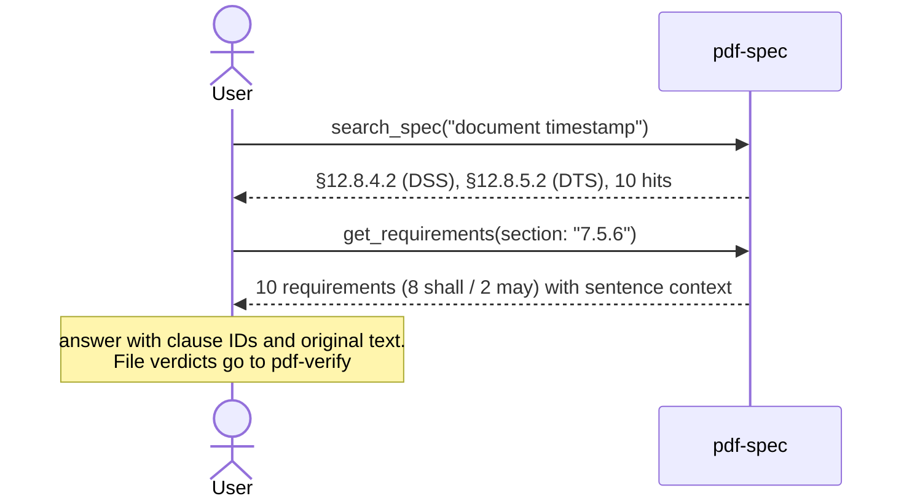

# Spec Research

## Scenario

"What does the specification require of incremental updates?" "Where is the document timestamp
defined?" — ground implementation and audit decisions in the **original text of ISO 32000**,
not in memory or a search engine. The only PDFs pdf-spec opens are its own spec corpus — never the PDF under examination: it answers what the specification
**requires**; whether a file **satisfies** it is pdf-verify's question.

Below are the **measured queries from 2026-09-04** (pdf-spec-mcp v0.6.0; lowering the
incoming audit's "incremental update after signing" onto the clauses. Corpus via `PDF_SPEC_DIR`).

## Cast

| Actor | Role |
|---|---|
| [pdf-spec](/mcp/pdf-spec) | `search_spec` (cross-search), `get_section` (clause text), `get_requirements` (structured shall/should/may), `compare_versions` |
| [pdf-verify](/mcp/pdf-verify) | The file side (when connecting research to actual checking) |

## Sequence



## Prompt examples

- "What does the spec require of incremental updates? With clauses"
- "Where is DocTimeStamp defined? And its relation to the DSS"
- "How did this section change between PDF 1.7 and 2.0?" (→ `compare_versions`)

## Measured example

`search_spec("document timestamp")` (`max_results`: 10) → **10 hits**. The first are **§12.8.4.2** (DSS introduction, pointing to the DTS), §12.8.4.3 (DSS dictionary), §12.8.1 (signature overview), §12.8.2.2.1 (DocMDP vs DSS/DTS incremental updates). The DTS body also hits §12.8.5.2 / §12.8.5.3.

`get_requirements(section: "7.5.6")` → **10 requirements (8 shall / 2 may)**.

::: details Call — search_spec and get_requirements
- Measured: pdf-spec-mcp v0.6.0
- Default spec: `iso32000-2`

**Parameters**

```jsonc
{ "query": "document timestamp", "max_results": 10 }
```

```jsonc
{ "section": "7.5.6" }
```

**Returned JSON** (search: first 4 hits; requirements: first item only)

```jsonc
{
  "query": "document timestamp",
  "totalResults": 10,
  "results": [
    { "section": "12.8.4.2", "title": "Introduction to the document security store (DSS)", "page": 600, "score": 18 },
    { "section": "12.8.4.3", "title": "Document Security Store (DSS)", "page": 601, "score": 10 },
    { "section": "12.8.1", "title": "General", "page": 583, "score": 9 },
    { "section": "12.8.2.2.1", "title": "General", "page": 588, "score": 9 }
  ]
}
```

```jsonc
{
  "totalRequirements": 10,
  "statistics": { "shall": 8, "may": 2 },
  "requirements": [
    {
      "id": "R-7.5.6-1",
      "level": "shall",
      "text": "When updating a PDF file incrementally, changes shall be appended to the end of the file, leaving its original contents intact.",
      "section": "7.5.6"
    }
  ]
}
```
:::

The "+9,938 bytes after signing" observed in the incoming audit is confirmed, in the original
text, to be the **legal form** of this clause (original intact, appended at the end — the
timestamp application).

## How to read the results

- **No hits = "this corpus cannot answer", never "no such requirement exists."**
  ISO 19005 (PDF/A) and ETSI PAdES are outside the corpus (read coverage.gaps in `list_specs`)
- shall / should / may in `get_requirements` is the strength of the requirement itself —
  implementation decisions start from not dropping a shall
- Reading a clause tells you what the specification demands. Whether the file in front of you
  meets it is measured with `validate_clauses` / `validate_conformance` (pdf-verify)
- Declaration, conformance and validation stay distinct — quoting a "shall" never proves the file in front of you meets the standard
